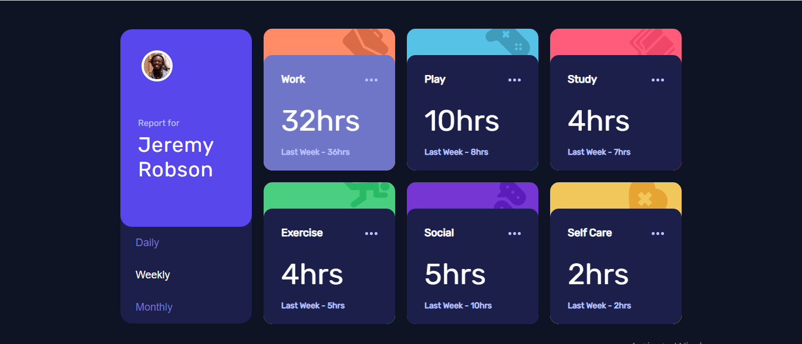

# Frontend Mentor - Time tracking dashboard solution

This is a solution to the [Time tracking dashboard challenge on Frontend Mentor](https://www.frontendmentor.io/challenges/time-tracking-dashboard-UIQ7167Jw). Frontend Mentor challenges help you improve your coding skills by building realistic projects. 

## Table of contents

- [Overview](#overview)
  - [The challenge](#the-challenge)
  - [Screenshot](#screenshot)
  - [Links](#links)
- [My process](#my-process)
  - [Built with](#built-with)
  - [Continued development](#continued-development)
  - [Useful resources](#useful-resources)
- [Author](#author)
- [Acknowledgments](#acknowledgments)

## Overview

### The challenge

Users should be able to:

- View the optimal layout for the site depending on their device's screen size
- See hover states for all interactive elements on the page
- Switch between viewing Daily, Weekly, and Monthly stats

### Screenshot

### Links

- Solution URL: [Add solution URL here](https://your-solution-url.com)
- Live Site URL: [Add live site URL here](https://your-live-site-url.com)

## My process

### Built with

- Create react app
- CSS custom properties
- Flexbox
- CSS Grid
- Mobile-first workflow
- [React](https://reactjs.org/) - JS library

### Continued development

- CSS flexbox
- CSS grid
- SVG styling
- Mobile-first workflow

### Useful resources

- [Stack overflow](https://www.stackoverflow.com) - This community helped me with many concepts I was not clear with. I really liked this community and will use it going forward.
- [Free codecamp](https://www.freecodecamp.org/news/taking-the-right-approach-to-responsive-web-design/#:~:text=Mobile%2Dfirst%20is%20when%20we,styling%20for%20larger%20screen%20sizes.&text=In%20that%20example%2C%20for%20small,re%20simply%20applying%20some%20padding.) - This is an amazing article which helped me finally understand responsive design. I'd recommend it to anyone still learning this concept.

## Author

- Frontend Mentor - [@drealmap](https://www.frontendmentor.io/profile/drealmap)
- Twitter - [@drealmap](https://www.twitter.com/drealmap)

## Acknowledgments

A big thank you to Bolaji Olapade for helping me out with answers to my questions on this project.
